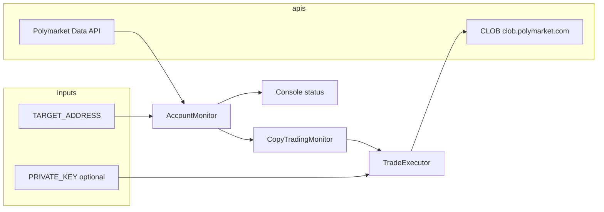
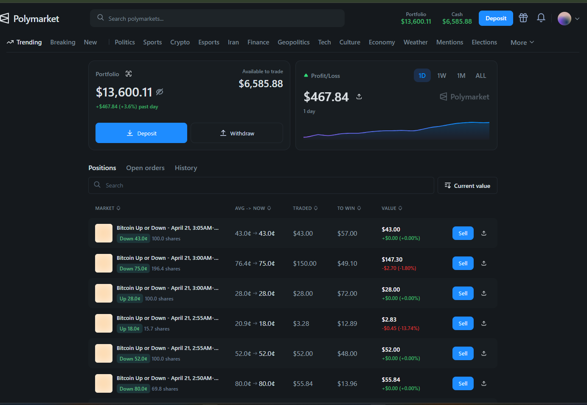
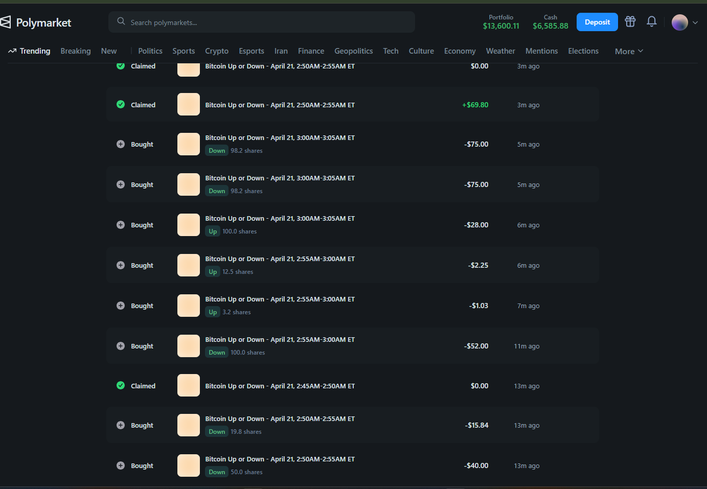
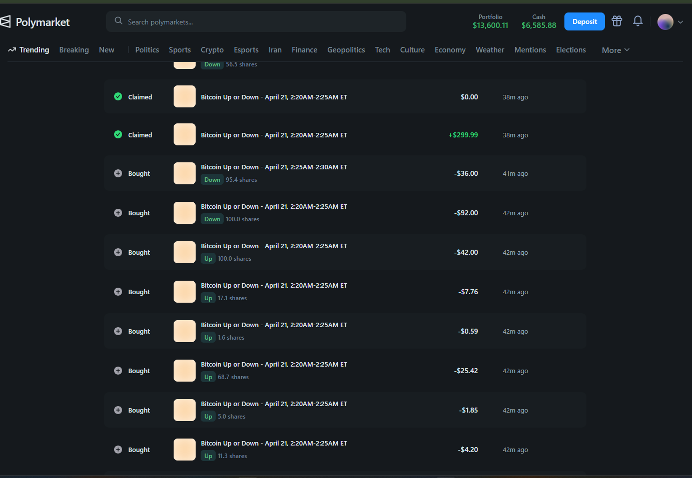

# Polymarket Trading Bot

[](https://github.com/Axion-Trading-Labs/polymarket-trading-bot)
[](https://opensource.org/licenses/MIT)

TypeScript service that **polls** a target Polygon wallet’s open [Polymarket](https://polymarket.com/) positions and optionally **mirrors** new entries and exits through Polymarket’s **CLOB** ([`@polymarket/clob-client`](https://www.npmjs.com/package/@polymarket/clob-client)).

---

## Table of contents

- [What this bot does](#what-this-bot-does)
- [Architecture](#architecture)
- [Prerequisites](#prerequisites)
- [Installation](#installation)
- [Configuration](#configuration)
- [Usage guide](#usage-guide)
- [How copy trading decides BUY / SELL](#how-copy-trading-decides-buy--sell)
- [Operations & production](#operations--production)
- [Risks and limitations](#risks-and-limitations)
- [Screenshot evidence (img folder)](#screenshot-evidence-img-folder)
- [Troubleshooting](#troubleshooting)
- [Project layout](#project-layout)
- [License](#license)

---

## What this bot does

| Mode | Behavior |
|------|----------|
| **Monitor only** | Reads the target address’s active positions from Polymarket’s Data API and prints a formatted status (no orders). |
| **Copy trading** | On each poll, compares the current position set to the previous snapshot. **New** positions trigger a **BUY**; positions that **disappeared** trigger a **SELL** (only if this process had previously recorded a successful BUY for that position id). |

Monitoring uses **HTTP polling**, not WebSockets (a WebSocket flag exists in code but is not implemented).

---

## Architecture



- **Positions** come from `https://data-api.polymarket.com` (see `PolymarketClient`).
- **Orders** go through the CLOB at `https://clob.polymarket.com` on **Polygon (chain id 137)**.

Before polling, the monitor checks a **USDC reference price** (via `web3.prc`). If the price is missing or below **0.987**, the monitor **does not** run updates until the check passes—this is a safety gate in `AccountMonitor`.

---

## Prerequisites

- **Node.js 18+**
- **Target wallet address** — Ethereum-style `0x…` address whose Polymarket positions you want to follow (from the trader’s [Polymarket profile](https://polymarket.com/) URL or on-chain).
- **For live copy trading:** a **Polygon** wallet **private key** with:
  - USDC (and POL/MATIC for gas) on Polygon as required by Polymarket for your account.
  - Ability to use the CLOB (the bot calls `createOrDeriveApiKey()` on startup in live mode).

---

## Installation

```bash
   git clone https://github.com/Axion-Trading-Labs/polymarket-trading-bot.git
   cd polymarket-trading-bot
npm install
```

Copy the environment template and edit it:

```bash
cp .env.example .env
# Edit .env — never commit real keys
```

---

## Configuration

All settings are read from **environment variables** (via `dotenv`). The table below matches what `src/index.ts` and the trading stack use.

### Required

| Variable | Description |
|----------|-------------|
| `TARGET_ADDRESS` | `0x`-prefixed address to monitor (and copy, if enabled). |

### Copy trading

| Variable | Default | Description |
|----------|---------|-------------|
| `COPY_TRADING_ENABLED` | `false` | Set `true` to enable BUY/SELL execution. |
| `PRIVATE_KEY` | — | **Required** if copy trading is on. Real 64-hex key; **never** use the `0x000…000` placeholder. |
| `DRY_RUN` | `false` | `true` = log intended trades only; **no** CLOB orders or API key derivation for trading. |

### Risk & sizing (USD)

| Variable | Default | Description |
|----------|---------|-------------|
| `POSITION_SIZE_MULTIPLIER` | `1.0` | Scales share quantity from the target position before sizing checks. |
| `MIN_TRADE_SIZE` | `1` | Skip trades whose computed USD notional is below this. |
| `MAX_TRADE_SIZE` | `5000` | Skip trades above this USD notional. |
| `MAX_POSITION_SIZE` | `10000` | Skip if scaled position **value** exceeds this USD cap. |
| `SLIPPAGE_TOLERANCE` | `1.0` | Present in config; **not applied** to posted order parameters in the current code path. |

### Polling & debugging

| Variable | Default | Description |
|----------|---------|-------------|
| `POLL_INTERVAL` | `2000` | Milliseconds between polls (**entry point** default). Lower = faster reactions, more API load. |
| `DEBUG` | — | When `true`, extra client logging may appear (e.g. pagination). |

> **Note:** `src/monitor/account-monitor.ts` uses `30000` ms only if `pollInterval` is omitted when constructing `AccountMonitor` directly. The CLI path in `src/index.ts` passes `POLL_INTERVAL` from the environment (default **2000** ms).

---

## Usage guide

Follow these steps in order. **Do not** enable live trading until you understand [risks and limitations](#risks-and-limitations).

### 1. Set the target address

1. Open the trader’s Polymarket profile (example used in this repo’s docs: [@zerotox](https://polymarket.com/@zerotox)).
2. Copy the wallet address shown on the profile (or from their on-chain activity).
3. In `.env`, set:

   ```env
   TARGET_ADDRESS=0xYourTargetAddressHere
   ```

### 2. Run in **monitor-only** mode (recommended first)

Leave copy trading off:

```env
COPY_TRADING_ENABLED=false
```

Start the bot:

```bash
npm run dev
```

**What to verify**

- Console shows polling and **no** trade execution.
- Position count matches what you see on Polymarket for that wallet (allow a few seconds for API delay).
- If you see warnings about **USDC price**, the monitor may skip cycles until the price feed is healthy—see [Troubleshooting](#troubleshooting).

Stop with **Ctrl+C** (SIGINT); the process exits cleanly.

### 3. Enable **copy trading** in **dry run**

Set:

```env
COPY_TRADING_ENABLED=true
PRIVATE_KEY=0xYourRealKeyForDryRunOrLive
DRY_RUN=true
```

Run:

```bash
npm run dev
```

**What to verify**

- Logs show **\[DRY RUN\]** when a BUY or SELL *would* run; no live `orderId` in dry-run success logs.
- New positions on the target produce a simulated BUY; closed positions produce a simulated SELL **only** for position ids the bot “remembers” buying in this session (see [How copy trading decides BUY / SELL](#how-copy-trading-decides-buy--sell)).

Tune `POSITION_SIZE_MULTIPLIER`, `MIN_TRADE_SIZE`, `MAX_TRADE_SIZE`, and `MAX_POSITION_SIZE` until skipped trades and sizes match your intent.

### 4. **Live** copy trading

Only after dry run behaves as expected:

```env
COPY_TRADING_ENABLED=true
PRIVATE_KEY=0xYourRealKey
DRY_RUN=false
```

Run:

```bash
npm run dev
```

On startup in live mode, the executor initializes the CLOB client and calls **`createOrDeriveApiKey()`**. Ensure your wallet is funded and allowed to trade on Polymarket.

**Operational checklist**

- [ ] `TARGET_ADDRESS` is correct.
- [ ] Sizing env vars match your risk tolerance.
- [ ] `POLL_INTERVAL` balances latency vs. rate limits.
- [ ] You accept that **restarts** reset in-memory state (see below).
- [ ] You can stop the bot safely (**Ctrl+C**); review final stats printed on SIGINT in copy-trading mode.

### 5. Production-style run

Build and run the compiled output (same env as development):

```bash
npm run build
npm start
```

For 24/7 operation, run `npm start` under a process manager (systemd, PM2, Docker, etc.), forward logs to your observability stack, and **restart only** during maintenance windows you understand.

---

## How copy trading decides BUY / SELL

1. **Poll** loads the target’s **open positions** (paginated where applicable).
2. **New position id** (present now, absent in the last snapshot) → attempt **BUY**, subject to sizing guards.
3. **Missing position id** (was open, now gone) → attempt **SELL** **only if** that id was previously marked as successfully bought in this process (`executedPositions` in `CopyTradingMonitor`).
4. **Sizing** (conceptually): scaled quantity × reference price → USD notional; must satisfy `MIN_TRADE_SIZE`, `MAX_TRADE_SIZE`, and `MAX_POSITION_SIZE` checks implemented in `TradeExecutor`.

Exact formulas live in `src/trading/trade-executor.ts`; keep code as the source of truth if behavior changes across versions.

---

## Operations & production

| Action | Command / note |
|--------|----------------|
| Development run | `npm run dev` |
| Typecheck / build | `npm run build` |
| Run compiled bot | `npm start` → `node dist/index.js` |
| Watch mode (types) | `npm run watch` |
| Stop | **Ctrl+C** — copy-trading mode prints basic stats on SIGINT |

---

## Risks and limitations

- **In-memory state only** — `executedPositions` and the last snapshot are **not** persisted. After a restart, the bot may treat existing target positions as **new** and attempt duplicate BUYs; SELL logic may not align with positions opened before the restart. Plan restarts carefully; consider operational procedures (e.g. manual reconciliation, disabling copy until flat).
- **Polling latency** — You are not co-located with the target; fills may differ in price and timing.
- **Not financial advice** — Past snapshots in this README are **examples** only; markets involve risk of loss.
- **`SLIPPAGE_TOLERANCE`** — Not wired into live order parameters in this version.
- **WebSockets** — Not used for monitoring; option name exists for future work.

---

## Screenshot evidence (img folder)

These images document **real [Polymarket](https://polymarket.com/)** UI: an active *Bitcoin Up or Down* strategy on short (≈5-minute) windows, **April 21, 2026** ET. Figures are **historical**; live balances and markets will differ.

**Profiles**

- **Target-style account** in the shots: portfolio in the **~$13.6k** range with a large **all-time** profit figure; use any trader’s [profile](https://polymarket.com/) or wallet as `TARGET_ADDRESS`.
- **Your bot’s wallet** when copy trading runs is the address from `PRIVATE_KEY`.

---

### `img/Screenshot_1.png` — Dashboard, portfolio band, and open *Positions*

**What the screen shows**

- **Header:** site search, **Portfolio** **$13,600.11** (up **+$467.84** / **+3.6%** past day), **Cash (available to trade)** **$6,585.88**; **Deposit** / **Withdraw**; category nav (e.g. Trending, Crypto, Sports).
- **Daily PnL** strip: intraday PnL **~$467.84** with a **rising** short chart (24h-style readout).
- **Positions table:** *Bitcoin Up or Down – April 21* windows around **2:50 AM – 3:05 AM** ET, **Up/Down** legs, share counts, **avg → now** in cents, **traded** / **to win** / **value** (e.g. $43, $150, $28, $2.83, $52, $55.84), and **Sell** on each row—mixed **gains and small mark-to-market losses** on sub-minute markets.

**Why it matters for this bot**

- Matches the **Data API** view the monitor ingests: **one row per outcome token**; the bot’s **BUY/SELL** diffs are driven when these rows **appear** or **disappear** between polls.



---

### `img/Screenshot_2.png` — Broader *Positions* and **all-time** PnL

**What the screen shows**

- **Portfolio** **$13,600.11** and **+3.6%** / **+$467.84** day; **cash** **$6,585.88** (aligned with the first screen).
- **All-time** profit/loss (e.g. **~$6,564.61**) with a long-horizon **up** trend chart.
- A similar **list of** *Bitcoin Up or Down* **April 21** 2:50–3:05 AM ET **positions** with traded notionals in the **~$3.28 – $150** band—illustrates **concurrent** Up/Down legs the target holds across overlapping 5-minute buckets.

**Why it matters for this bot**

- Shows **fan-out** and **trade-size spread** (from a few dollars to **$150+** on a single leg), which your **`MAX_TRADE_SIZE`**, **`MAX_POSITION_SIZE`**, and **`POSITION_SIZE_MULTIPLIER`** must be sized for if you want copies without constant skips.


---

### `img/Screenshot_3.png` — *History* feed (*Claimed* + *Bought*)

**What the screen shows**

- Same **~$13.6k** portfolio and **~$6.5k** cash in the bar.
- **Activity / History** style list: interleaved **Claimed** (wins, e.g. **+$69.80** or break-even) and **Bought** (debits like **–$75**, **–$28**, **–$2.25**, **–$52** …) on *Bitcoin Up or Down – April 21* intervals such as **2:50–2:55** and **3:00–3:05** AM ET, with **Up/Down** tags and share lines (**98.2**, **100.0**, **12.5** …), timestamps **3–13 minutes** ago.

**Why it matters for this bot**

- **Bought** lines are closest to your **CLOB** activity; **Claimed** is **settlement** after a market **resolves**—complement, not a duplicate, of the bot’s **SELL-on-close** snapshot. Use this view to **reconcile** copy behavior in **live** mode.



---

### `img/Screenshot_4.png` — *History* (larger *Claimed* and dense *Bought* cluster)

**What the screen shows**

- **Claimed** entries (e.g. **+$299.99**, **$0.00** break-even) and many **Bought** lines in the **–$0.59 … –$92.00** range, on windows such as **2:20–2:30** and **2:25–2:30** AM ET, **3–42 minutes** ago—**Up/Down** mix (e.g. 95.4, 100.0, 17.1, 1.6 shares, …).

**Why it matters for this bot**

- Demonstrates **burst trading** in the same **minute** on a fast account; for your runner that implies **POLL_INTERVAL** and **per-trade caps** that avoid over-trading, plus expectations that **not every** target **micro** fill will be copied if **`MIN_TRADE_SIZE`** and exchange minima **filter** it.



---

### Features (summary)

- Single `TARGET_ADDRESS` polling loop
- Optional copy trading with **dry run**
- USD-based min/max position and trade guardrails
- Formatted console output for open positions

---

## Troubleshooting

| Symptom | What to check |
|---------|----------------|
| `TARGET_ADDRESS` error on start | Variable set in `.env` or shell; valid `0x` address. |
| `Invalid PRIVATE_KEY` | Non-empty key, not all zeros; 64 hex chars (with optional `0x`). Required when `COPY_TRADING_ENABLED=true`. |
| No positions / empty list | Target actually has **active** positions; Data API delay; try `DEBUG=true`. |
| Polling skipped / USDC warnings | USDC price gate in `AccountMonitor`; ensure price feed works or adjust environment so `prices()` from `web3.prc` succeeds. |
| CLOB init failure (live) | Network, Polygon RPC, wallet funded, Polymarket account eligibility. |
| Orders not matching expectations | Review [How copy trading decides BUY / SELL](#how-copy-trading-decides-buy--sell) and sizing env vars; confirm you did not restart into an ambiguous state. |

---

## Project layout

| Path | Role |
|------|------|
| `src/index.ts` | CLI entry: env validation, monitor vs copy-trading mode, signals. |
| `src/api/polymarket-client.ts` | Data API client for positions (and related helpers). |
| `src/monitor/account-monitor.ts` | Polling, USDC check, change detection, formatted status. |
| `src/trading/copy-trading-monitor.ts` | Diff snapshots → BUY/SELL coordination and stats. |
| `src/trading/trade-executor.ts` | CLOB wallet client, order placement, dry-run simulation. |
| `src/types/` | Shared TypeScript types. |

---

## License

MIT (see `package.json`).
