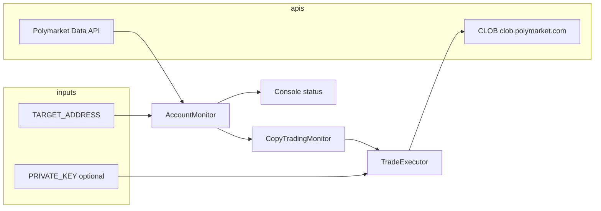
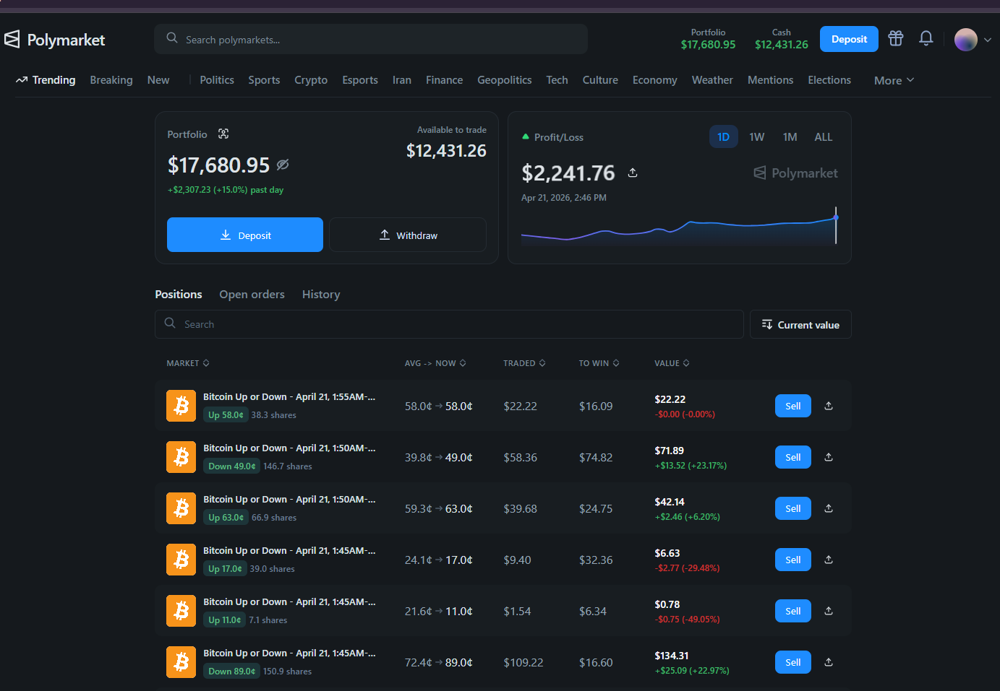
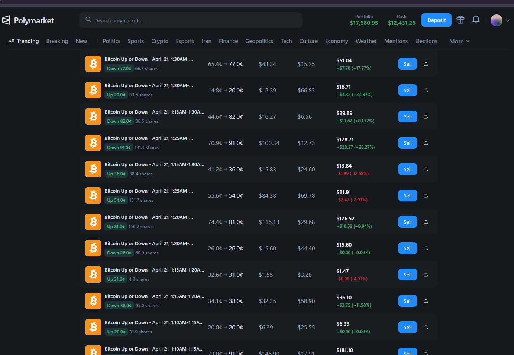
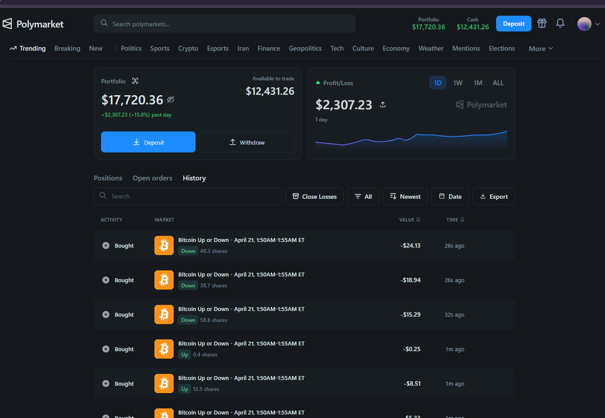
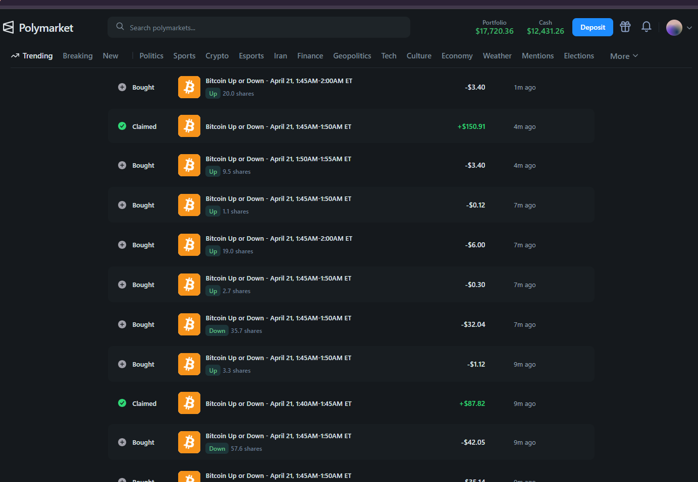
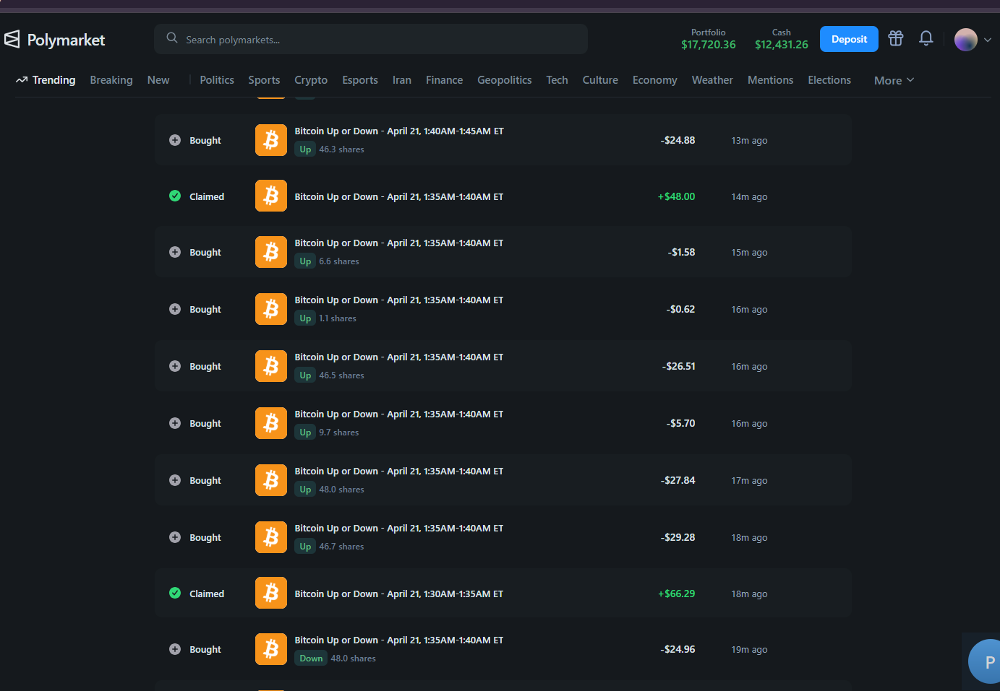

# Polymarket Copy Trading Bot

[](https://github.com/TradeFlow-Systems/polymarket-copy-trading-bot)
[](https://opensource.org/licenses/MIT)

TypeScript service that **polls** a target Polygon wallet’s open [Polymarket](https://polymarket.com/) positions and optionally **mirrors** new entries and exits through Polymarket’s **CLOB** ([`@polymarket/clob-client`](https://www.npmjs.com/package/@polymarket/clob-client)).

---

## Table of contents

- [What this bot does](#what-this-bot-does)
- [Architecture](#architecture)
- [Prerequisites](#prerequisites)
- [Installation](#installation)
- [Configuration](#configuration)
- [Usage guide](#usage-guide)
- [How copy trading decides BUY / SELL](#how-copy-trading-decides-buy--sell)
- [Operations & production](#operations--production)
- [Risks and limitations](#risks-and-limitations)
- [Screenshot evidence (img folder)](#screenshot-evidence-img-folder)
- [Troubleshooting](#troubleshooting)
- [Project layout](#project-layout)
- [License](#license)

---

## What this bot does

| Mode | Behavior |
|------|----------|
| **Monitor only** | Reads the target address’s active positions from Polymarket’s Data API and prints a formatted status (no orders). |
| **Copy trading** | On each poll, compares the current position set to the previous snapshot. **New** positions trigger a **BUY**; positions that **disappeared** trigger a **SELL** (only if this process had previously recorded a successful BUY for that position id). |

Monitoring uses **HTTP polling**, not WebSockets (a WebSocket flag exists in code but is not implemented).

---

## Architecture



- **Positions** come from `https://data-api.polymarket.com` (see `PolymarketClient`).
- **Orders** go through the CLOB at `https://clob.polymarket.com` on **Polygon (chain id 137)**.

Before polling, the monitor checks a **USDC reference price** (via `web3.prc`). If the price is missing or below **0.987**, the monitor **does not** run updates until the check passes—this is a safety gate in `AccountMonitor`.

---

## Prerequisites

- **Node.js 18+**
- **Target wallet address** — Ethereum-style `0x…` address whose Polymarket positions you want to follow (from the trader’s [Polymarket profile](https://polymarket.com/) URL or on-chain).
- **For live copy trading:** a **Polygon** wallet **private key** with:
  - USDC (and POL/MATIC for gas) on Polygon as required by Polymarket for your account.
  - Ability to use the CLOB (the bot calls `createOrDeriveApiKey()` on startup in live mode).

---

## Installation

```bash
git clone https://github.com/TradeFlow-Systems/polymarket-copy-trading-bot.git
cd polymarket-copy-trading-bot
npm install
```

Copy the environment template and edit it:

```bash
cp .env.example .env
# Edit .env — never commit real keys
```

---

## Configuration

All settings are read from **environment variables** (via `dotenv`). The table below matches what `src/index.ts` and the trading stack use.

### Required

| Variable | Description |
|----------|-------------|
| `TARGET_ADDRESS` | `0x`-prefixed address to monitor (and copy, if enabled). |

### Copy trading

| Variable | Default | Description |
|----------|---------|-------------|
| `COPY_TRADING_ENABLED` | `false` | Set `true` to enable BUY/SELL execution. |
| `PRIVATE_KEY` | — | **Required** if copy trading is on. Real 64-hex key; **never** use the `0x000…000` placeholder. |
| `DRY_RUN` | `false` | `true` = log intended trades only; **no** CLOB orders or API key derivation for trading. |

### Risk & sizing (USD)

| Variable | Default | Description |
|----------|---------|-------------|
| `POSITION_SIZE_MULTIPLIER` | `1.0` | Scales share quantity from the target position before sizing checks. |
| `MIN_TRADE_SIZE` | `1` | Skip trades whose computed USD notional is below this. |
| `MAX_TRADE_SIZE` | `5000` | Skip trades above this USD notional. |
| `MAX_POSITION_SIZE` | `10000` | Skip if scaled position **value** exceeds this USD cap. |
| `SLIPPAGE_TOLERANCE` | `1.0` | Present in config; **not applied** to posted order parameters in the current code path. |

### Polling & debugging

| Variable | Default | Description |
|----------|---------|-------------|
| `POLL_INTERVAL` | `2000` | Milliseconds between polls (**entry point** default). Lower = faster reactions, more API load. |
| `DEBUG` | — | When `true`, extra client logging may appear (e.g. pagination). |

> **Note:** `src/monitor/account-monitor.ts` uses `30000` ms only if `pollInterval` is omitted when constructing `AccountMonitor` directly. The CLI path in `src/index.ts` passes `POLL_INTERVAL` from the environment (default **2000** ms).

---

## Usage guide

Follow these steps in order. **Do not** enable live trading until you understand [risks and limitations](#risks-and-limitations).

### 1. Set the target address

1. Open the trader’s Polymarket profile (example target used in this repo’s docs: [profile `0xf381…2b5d`](https://polymarket.com/profile/0xf38190909d9f72d4d3274dc5fa51ad8e42ca2b5d)).
2. Copy the wallet address shown on the profile (or from their on-chain activity).
3. In `.env`, set:

   ```env
   TARGET_ADDRESS=0xYourTargetAddressHere
   ```

### 2. Run in **monitor-only** mode (recommended first)

Leave copy trading off:

```env
COPY_TRADING_ENABLED=false
```

Start the bot:

```bash
npm run dev
```

**What to verify**

- Console shows polling and **no** trade execution.
- Position count matches what you see on Polymarket for that wallet (allow a few seconds for API delay).
- If you see warnings about **USDC price**, the monitor may skip cycles until the price feed is healthy—see [Troubleshooting](#troubleshooting).

Stop with **Ctrl+C** (SIGINT); the process exits cleanly.

### 3. Enable **copy trading** in **dry run**

Set:

```env
COPY_TRADING_ENABLED=true
PRIVATE_KEY=0xYourRealKeyForDryRunOrLive
DRY_RUN=true
```

Run:

```bash
npm run dev
```

**What to verify**

- Logs show **\[DRY RUN\]** when a BUY or SELL *would* run; no live `orderId` in dry-run success logs.
- New positions on the target produce a simulated BUY; closed positions produce a simulated SELL **only** for position ids the bot “remembers” buying in this session (see [How copy trading decides BUY / SELL](#how-copy-trading-decides-buy--sell)).

Tune `POSITION_SIZE_MULTIPLIER`, `MIN_TRADE_SIZE`, `MAX_TRADE_SIZE`, and `MAX_POSITION_SIZE` until skipped trades and sizes match your intent.

### 4. **Live** copy trading

Only after dry run behaves as expected:

```env
COPY_TRADING_ENABLED=true
PRIVATE_KEY=0xYourRealKey
DRY_RUN=false
```

Run:

```bash
npm run dev
```

On startup in live mode, the executor initializes the CLOB client and calls **`createOrDeriveApiKey()`**. Ensure your wallet is funded and allowed to trade on Polymarket.

**Operational checklist**

- [ ] `TARGET_ADDRESS` is correct.
- [ ] Sizing env vars match your risk tolerance.
- [ ] `POLL_INTERVAL` balances latency vs. rate limits.
- [ ] You accept that **restarts** reset in-memory state (see below).
- [ ] You can stop the bot safely (**Ctrl+C**); review final stats printed on SIGINT in copy-trading mode.

### 5. Production-style run

Build and run the compiled output (same env as development):

```bash
npm run build
npm start
```

For 24/7 operation, run `npm start` under a process manager (systemd, PM2, Docker, etc.), forward logs to your observability stack, and **restart only** during maintenance windows you understand.

---

## How copy trading decides BUY / SELL

1. **Poll** loads the target’s **open positions** (paginated where applicable).
2. **New position id** (present now, absent in the last snapshot) → attempt **BUY**, subject to sizing guards.
3. **Missing position id** (was open, now gone) → attempt **SELL** **only if** that id was previously marked as successfully bought in this process (`executedPositions` in `CopyTradingMonitor`).
4. **Sizing** (conceptually): scaled quantity × reference price → USD notional; must satisfy `MIN_TRADE_SIZE`, `MAX_TRADE_SIZE`, and `MAX_POSITION_SIZE` checks implemented in `TradeExecutor`.

Exact formulas live in `src/trading/trade-executor.ts`; keep code as the source of truth if behavior changes across versions.

---

## Operations & production

| Action | Command / note |
|--------|----------------|
| Development run | `npm run dev` |
| Typecheck / build | `npm run build` |
| Run compiled bot | `npm start` → `node dist/index.js` |
| Watch mode (types) | `npm run watch` |
| Stop | **Ctrl+C** — copy-trading mode prints basic stats on SIGINT |

---

## Risks and limitations

- **In-memory state only** — `executedPositions` and the last snapshot are **not** persisted. After a restart, the bot may treat existing target positions as **new** and attempt duplicate BUYs; SELL logic may not align with positions opened before the restart. Plan restarts carefully; consider operational procedures (e.g. manual reconciliation, disabling copy until flat).
- **Polling latency** — You are not co-located with the target; fills may differ in price and timing.
- **Not financial advice** — Past snapshots in this README are **examples** only; markets involve risk of loss.
- **`SLIPPAGE_TOLERANCE`** — Not wired into live order parameters in this version.
- **WebSockets** — Not used for monitoring; option name exists for future work.

---

## Screenshot evidence (img folder)

These images document **real Polymarket UI** around short-horizon *Bitcoin Up or Down* markets (five-minute style windows). They are **historical** captures (April 2026); balances, PnL, and markets on [Polymarket](https://polymarket.com/) change continuously.

**Profiles**

- **Example target wallet** (for `TARGET_ADDRESS`): [Polymarket profile `0xf381…2b5d`](https://polymarket.com/profile/0xf38190909d9f72d4d3274dc5fa51ad8e42ca2b5d)
- **Your bot’s wallet** when copy trading runs is the address from `PRIVATE_KEY`.

---

### `img/1.png` — Positions tab (portfolio header + active table)

**What the screen shows**

- **Tabs:** *Positions* (selected), *Open orders*, *History*.
- **Header summary:** total portfolio value **$17,680.95**; **past-day** move **+$2,307.23 (+15.0%)**; **available cash** **$12,431.26**.
- **1D PnL card:** about **$2,241.76** 1-day PnL with timestamp (e.g. April 21, 2026 ~2:46 PM ET) and a **rising** intraday PnL curve.
- **Positions table** (excerpt): multiple *Bitcoin Up or Down* rows for **April 21** early-morning ET windows (e.g. **1:55 AM**, **1:50 AM**, **1:45 AM**). Columns include **market**, **side & share count**, **average → current** price in cents, **notional traded**, **to win**, **mark value**, **unrealized PnL** (dollar and %), and a **Sell** action per row. Example rows include both **Up** and **Down** legs on overlapping windows, with mixed PnL (wins and small drawdowns).

**Why it matters for this bot**

- Mirrors what **`getUserPositions` / the monitor** is trying to reflect: **open** legs, sizes, and mark PnL until the target **closes** or **resolves** a market—events that drive the bot’s **BUY** (new row) / **SELL** (row gone) logic.



---

### `img/2.png` — Positions list (scroll: more concurrent windows)

**What the screen shows**

- Same **portfolio/cash** style header (total value in the **~$17.7k** range on this capture).
- A **longer scroll** of *Bitcoin Up or Down* positions across **adjacent 5-minute buckets** (e.g. **1:30 AM**, **1:25 AM**, **1:20 AM**, **1:15 AM–1:30 AM**, **1:15 AM–1:20 AM**, **1:10 AM–1:15 AM** ET).
- Each row: **Up** or **Down**, **current price** in cents, **share count**, **prior → current** price, **position value**, and **unrealized PnL** (green/red). Shows how **many parallel binary legs** a fast trader can hold—relevant to **poll interval** load and **sizing caps** (`MAX_POSITION_SIZE`, `MAX_TRADE_SIZE`).

**Why it matters for this bot**

- Illustrates **fan-out**: one target can hold **many** simultaneous position ids; the copy trader should size conservatively and understand **latency** versus a human clicking **Sell** on each row.



---

### `img/3.png` — Portfolio summary + History tab (recent *Bought*)

**What the screen shows**

- **Portfolio** ~**$17,720.36** and **cash** **$12,431.26**; **1D PnL** ~**$2,307.23** with an **up** chart.
- **History** tab selected; recent lines are **Bought** on **Bitcoin Up or Down – April 21, 1:50 AM–1:55 AM ET**, mixing **Down** and **Up** share counts and debit notionals (e.g. tens of dollars per clip), with **relative timestamps** (seconds/minutes ago).

**Why it matters for this bot**

- **History** is the **ledger of fills**; the bot’s **CLOB BUY** attempts should eventually show up here in live mode (timing and prices will not match the target tick-for-tick). Use it to **reconcile** what the bot did versus what you expected from dry run logs.



---

### `img/4.png` — History (*Bought* vs *Claimed* after resolution)

**What the screen shows**

- **Bought** lines: small to medium **Up**/**Down** purchases on **1:45 AM–2:00 AM** and **1:50 AM–1:55 AM** style markets.
- **Claimed** lines: **credits** after **winning** resolution (e.g. **+$150.91**, **+$87.82**) on completed windows such as **1:45 AM–1:50 AM** and **1:40 AM–1:45 AM** ET—i.e. **redemption / settlement cash** hitting the wallet, not an ordinary limit sell.

**Why it matters for this bot**

- The bot’s **SELL** path is tied to **open positions disappearing** from the **positions** snapshot; **Claimed** flows are **post-resolution** economics the **CLOB mirror does not fully replicate** by itself. Treat **Claimed** screenshots as **PnL realization** context, not as a 1:1 map to `executeSell` behavior.



---

### `img/5.png` — History (dense *Bought* ladder + *Claimed*)

**What the screen shows**

- A **dense sequence** of **Bought** tickets on **1:35 AM–1:40 AM** and neighboring windows (**Up** and **Down**), with notionals from **under $1** to **~$29** per line.
- Interleaved **Claimed** entries (e.g. **+$48.00**, **+$66.29**) on **1:30 AM–1:35 AM** / **1:35 AM–1:40 AM** style markets—again, **settlement** style credits after the event resolves.

**Why it matters for this bot**

- Shows **high-frequency scaling**: many small orders. That maps directly to **`MIN_TRADE_SIZE` / `MAX_TRADE_SIZE`** and to operational load (logs, API rate limits). Use **`DRY_RUN=true`** first to see how many **simulated** orders your settings would allow in a similar session.



---

### Features (summary)

- Single `TARGET_ADDRESS` polling loop
- Optional copy trading with **dry run**
- USD-based min/max position and trade guardrails
- Formatted console output for open positions

---

## Troubleshooting

| Symptom | What to check |
|---------|----------------|
| `TARGET_ADDRESS` error on start | Variable set in `.env` or shell; valid `0x` address. |
| `Invalid PRIVATE_KEY` | Non-empty key, not all zeros; 64 hex chars (with optional `0x`). Required when `COPY_TRADING_ENABLED=true`. |
| No positions / empty list | Target actually has **active** positions; Data API delay; try `DEBUG=true`. |
| Polling skipped / USDC warnings | USDC price gate in `AccountMonitor`; ensure price feed works or adjust environment so `prices()` from `web3.prc` succeeds. |
| CLOB init failure (live) | Network, Polygon RPC, wallet funded, Polymarket account eligibility. |
| Orders not matching expectations | Review [How copy trading decides BUY / SELL](#how-copy-trading-decides-buy--sell) and sizing env vars; confirm you did not restart into an ambiguous state. |

---

## Project layout

| Path | Role |
|------|------|
| `src/index.ts` | CLI entry: env validation, monitor vs copy-trading mode, signals. |
| `src/api/polymarket-client.ts` | Data API client for positions (and related helpers). |
| `src/monitor/account-monitor.ts` | Polling, USDC check, change detection, formatted status. |
| `src/trading/copy-trading-monitor.ts` | Diff snapshots → BUY/SELL coordination and stats. |
| `src/trading/trade-executor.ts` | CLOB wallet client, order placement, dry-run simulation. |
| `src/types/` | Shared TypeScript types. |

---

## License

MIT (see `package.json`).
